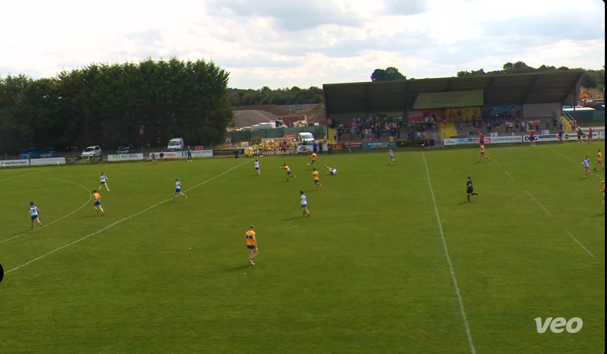
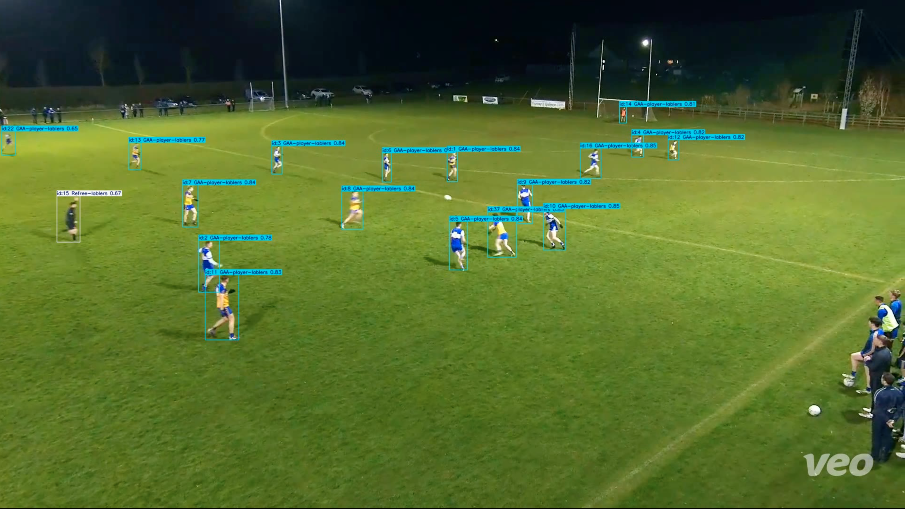
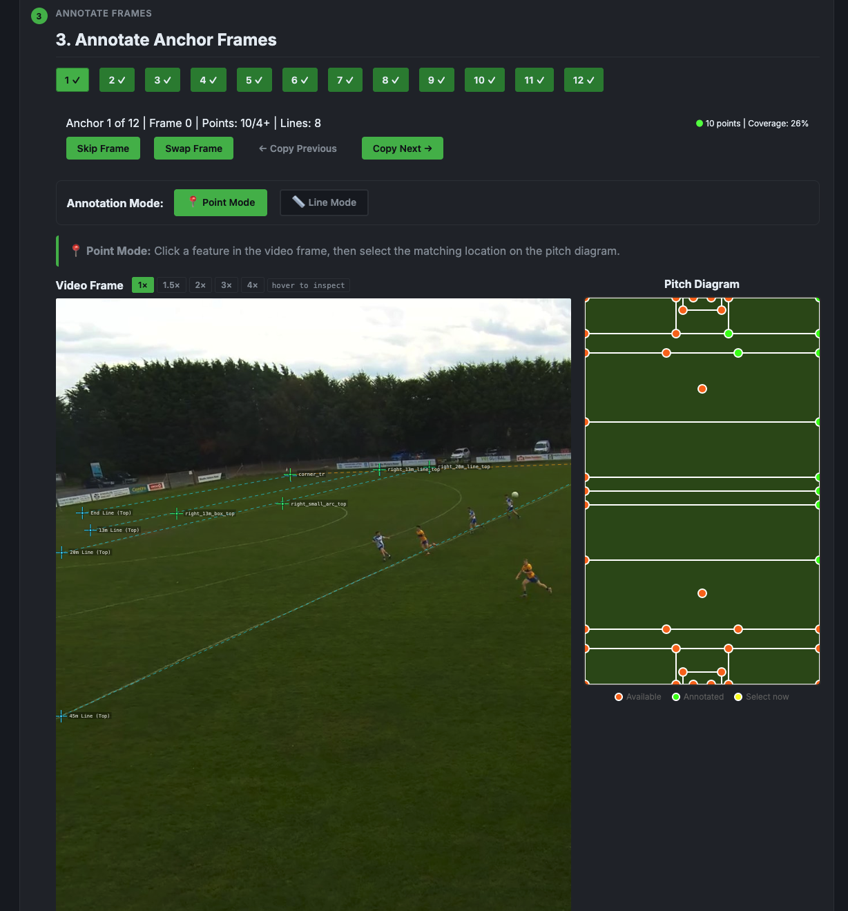
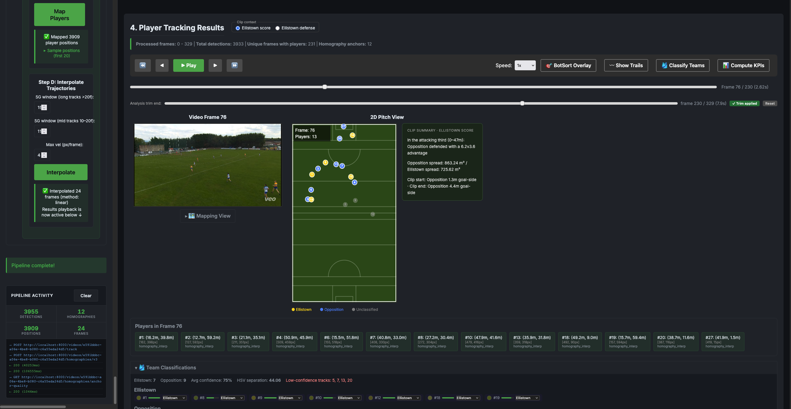
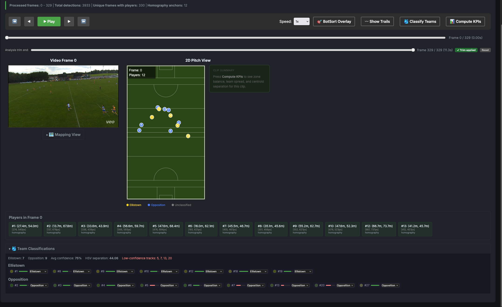
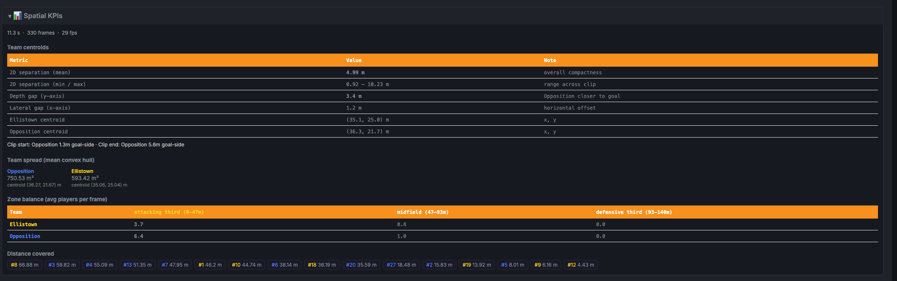

# GAA Video Analysis

A full-stack system for analysing GAA (Gaelic football) match footage. Upload an MP4, annotate a handful of anchor frames, and the pipeline produces a calibrated 2D bird's-eye trajectory map of every player — complete with team classification and spatial KPIs.

---

## Screenshots

### Raw Match Footage

*Input: broadcast-quality GAA match footage.*

### Player Detection & Tracking (YOLO + BotSort)

*YOLOv8-small detects players, ball, and referees; BotSort assigns persistent track IDs across frames.*

### Match Footage & Annotation

*Left: raw match frame at zoom. Right: GAA pitch diagram with snap-to-vertex annotation.*

### Bird's-Eye Tracking

*Side-by-side video playback and real-time 2D pitch with team-coloured player dots.*

### Team Classification

*Per-track jersey-colour swatches, confidence scores, and manual override controls.*

### KPI Dashboard

*Distance covered, team centroids, convex hull spread, and zone balance across the clip.*

---

## Features

- **Custom YOLO model** — YOLOv8-small trained on GAA footage; detects players, the ball, and referees across all frames via BotSort tracking
- **Serverless GPU inference** — heavy tracking offloaded to a Modal T4 worker; the backend server needs no GPU
- **Interactive annotation** — point and line annotation modes; snap-to-vertex and snap-to-line; zoom 1–4×; auto-saved to `localStorage`
- **Weighted DLT homography (v3)** — Hartley-normalised SVD with line constraints; per-frame propagation via Lucas-Kanade optical flow with forward-backward filtering and linear drift correction
- **Trajectory smoothing** — Savitzky-Golay filter + max-velocity clamp; covers detected and interpolated frames alike
- **Team classification** — single-pass HSV jersey-colour analysis; manual override per track
- **Spatial KPIs** — distance covered, team centroids, convex hull spread, zone balance (thirds), plain-English clip summary

---

## Architecture

```
┌──────────────────────────────────────────────────────────────────┐
│  Browser  (Next.js / React / TypeScript)                          │
│  Upload → Annotate → Run Pipeline (A→B→C→D) → Results + KPIs    │
└──────────────────────────────┬───────────────────────────────────┘
                               │  HTTP REST + JSON
                               ▼
┌──────────────────────────────────────────────────────────────────┐
│  FastAPI Backend  (Python / OpenCV / NumPy / SciPy)               │
│  routes/  ←→  pipeline/  ←→  store.py  ←→  data/ (disk)         │
└──────────────────────────────┬───────────────────────────────────┘
                               │  base64 video → JSON detections
                               ▼
┌──────────────────────────────────────────────────────────────────┐
│  Modal GPU Worker  (T4)  —  YOLOv8-small + BotSort               │
└──────────────────────────────────────────────────────────────────┘
```

The backend is stateless between restarts except for files in `data/`. GPU inference is fully optional — set `GPU_PROVIDER=local` to skip it.

---

## Quick Start

### Backend

```bash
cd interactive_analytics_system_backend
pip install -r requirements.txt
uvicorn app:app --reload --port 8000
```

### Frontend

```bash
cd Interactive_analytics_system_frontend
npm install
NEXT_PUBLIC_API_URL=http://localhost:8000 npm run dev
```

### GPU Inference (Modal)

```bash
pip install modal
modal token new
modal volume put yolo-model-cache path/to/v8s_960_v9.pt /v8s_960_v9.pt
modal deploy interactive_analytics_system_backend/gpu_inference/modal_yolo.py
# Copy the printed endpoint URL into your environment:
export GPU_PROVIDER=modal
export GPU_ENDPOINT_URL="https://..."
```

Without Modal, set `GPU_PROVIDER=local` to use CPU inference (slow, but functional).

### Running Tests

```bash
cd interactive_analytics_system_backend
pytest tests/ -v
```

70 tests pass. 1 pre-existing failure: `test_validate_tilted_line_fails` in `test_line_constraints.py` (unrelated to core pipeline).

---

## Environment Variables

| Variable | Default | Description |
|----------|---------|-------------|
| `GPU_PROVIDER` | `"local"` | `"modal"` for remote GPU, `"local"` for CPU fallback |
| `GPU_ENDPOINT_URL` | — | Deployed Modal endpoint URL (required when `GPU_PROVIDER=modal`) |
| `MAX_VIDEO_SIZE_MB` | `500` | Upload size limit |
| `ALLOWED_ORIGINS` | `"*"` | Comma-separated CORS origin list |
| `DATA_DIR` | `"data"` | Root directory for all persisted files |
| `YOLO_MODEL_PATH` | `"models/v8s_960_v9.pt"` | Path to YOLO weights for local inference |
| `NEXT_PUBLIC_API_URL` | `"http://localhost:8000"` | Backend base URL (set at frontend build time) |

---

## Further Reading

Full technical documentation is in [`TECHNICAL_OVERVIEW.md`](TECHNICAL_OVERVIEW.md).

| Topic | Section |
|-------|---------|
| Repository layout & file map | [1](TECHNICAL_OVERVIEW.md#1-repository-layout) |
| Coordinate systems (image / canvas / meters / display) | [3](TECHNICAL_OVERVIEW.md#3-coordinate-systems) |
| Homography algorithm — weighted DLT, Hartley normalisation | [4.5](TECHNICAL_OVERVIEW.md#45-homography-computation-v3) |
| Per-frame propagation — LK optical flow, drift correction | [4.6](TECHNICAL_OVERVIEW.md#46-per-frame-propagation-optical-flow) |
| Player mapping & filtering | [4.7](TECHNICAL_OVERVIEW.md#47-player-mapping) |
| Trajectory interpolation & smoothing | [4.8](TECHNICAL_OVERVIEW.md#48-trajectory-interpolation--smoothing) |
| Team classification algorithm | [4.10](TECHNICAL_OVERVIEW.md#410-team-classification) |
| KPI computation | [4.11](TECHNICAL_OVERVIEW.md#411-kpi-computation) |
| API endpoint reference | [7](TECHNICAL_OVERVIEW.md#7-api-endpoint-reference) |
| Known limitations & TODOs | [12](TECHNICAL_OVERVIEW.md#12-known-limitations--todos) |
| Development history (v1 → v2 → v3) | [13](TECHNICAL_OVERVIEW.md#13-development-history--what-was-tried-what-worked-what-didnt) |
